# Run OpenSees Interactive at the CLI

## Why Start with OpenSees Interactive?

Before running scripts or submitting jobs to HPC, it’s useful to begin by running **OpenSees interactively at the command line**. This simple step serves several important purposes:

* **Confirm installation** → Running interactively checks that OpenSees is available in your current environment.
* **Check version information** → When the interpreter starts, it displays the version number, which is important to record for reproducibility.
* **Understand which interpreter you’re using** →

  * Typing `OpenSees` launches the **Tcl interpreter**.
  * Typing `python` launches the **Python interpreter**, where you must import `openseespy.opensees` before calling OpenSees commands.

Starting interactively also helps you get comfortable with the prompt and experiment with simple commands one at a time. This is especially helpful when learning OpenSees or troubleshooting a new environment.

### Tcl vs. Python in OpenSees

Both interpreters provide access to the same core simulation engine, but each has its own advantages:

* **OpenSees-Tcl**

  * Best for running existing Tcl scripts (many legacy examples are Tcl-based).
  * Provides a minimal environment focused solely on OpenSees commands.
  * Good for quick checks or lightweight scripting.

* **OpenSeesPy (Python)**

  * Best for new projects or when integrating OpenSees with the broader scientific Python ecosystem (NumPy, Pandas, Matplotlib, Jupyter notebooks, etc.).
  * Supports modern scripting, automation, and data analysis workflows.
  * Easier to combine OpenSees with pre- and post-processing tools.

In short: **use Tcl if you are following older tutorials or running legacy scripts**, and **use Python for modern workflows and HPC integration**.

---

## OpenSees-Tcl

Start OpenSees-Tcl interactively by simply typing at the terminal:

    OpenSees

You’ll see a prompt like:

        OpenSees -- Open System For Earthquake Engineering Simulation
                Pacific Earthquake Engineering Research Center
                        Version xx.xx.xx 64-Bit

    (c) Copyright 1999-20xx The Regents of the University of California
                            All Rights Reserved
    (Copyright and Disclaimer @ http://www.berkeley.edu/OpenSees/copyright.html)

    OpenSees > 

You can now enter your commands at the prompt, one at a time, as shown below:
  
    OpenSees > wipe
    OpenSees > model BasicBuilder -ndm 2 -ndf 3
    OpenSees > exit

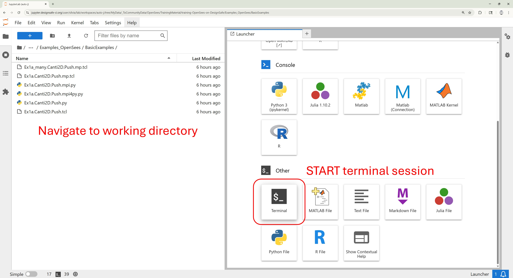

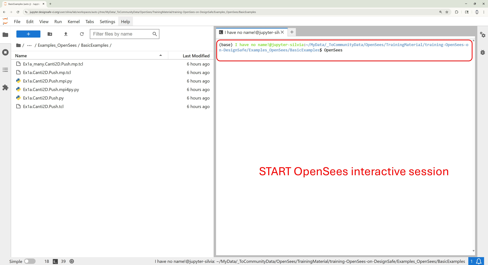
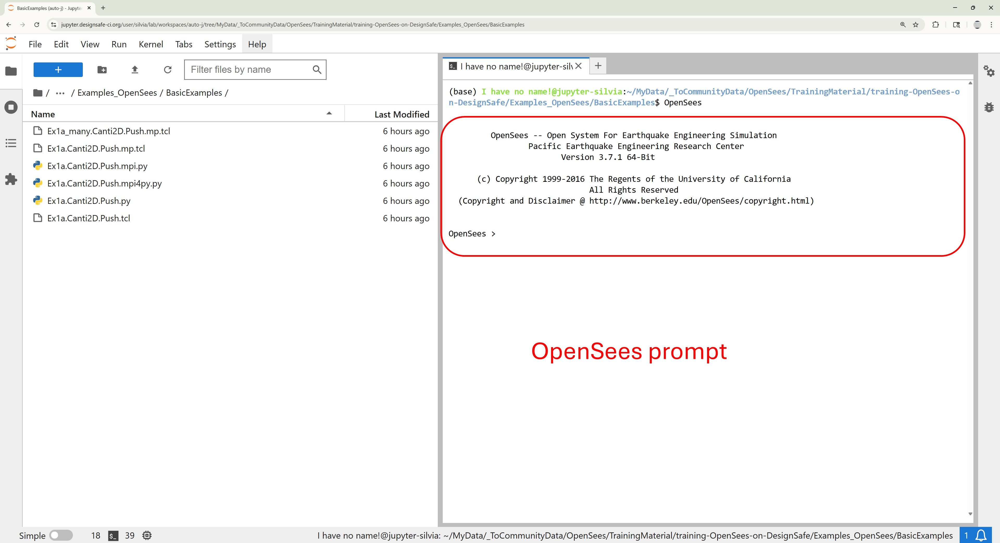
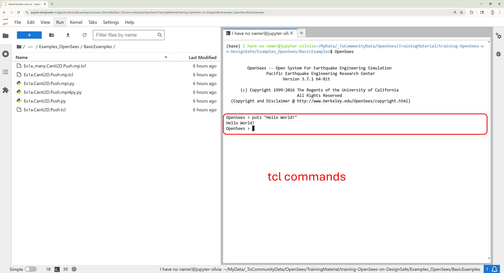
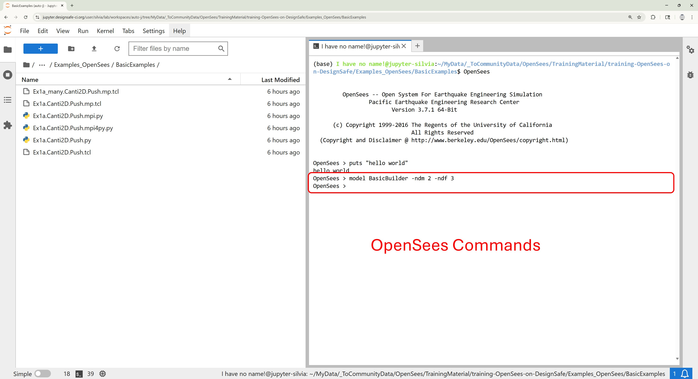
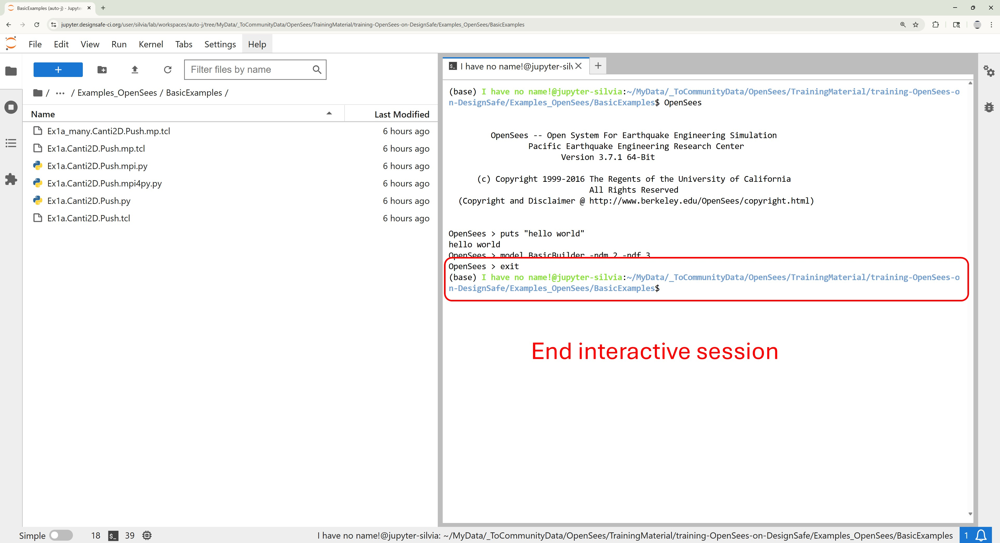

## OpenSeesPy

Start python interactively by simply typing at the terminal:

       python
    
The command-line command will start an interactive session. 

    Python 3.10.6 | packaged by conda-forge | (main, Aug 22 2022, 20:35:26) [GCC 10.4.0] on linux
    Type "help", "copyright", "credits" or "license" for more information.
    >>> 

You can now enter your commands at the prompt, one at a time, as shown below. You need to import OpenSeesPy before you can run OpenSees commands:

    >>> import openseespy.opensees as ops
    >>> ops.wipe()
    >>> ops.model('BasicBuilder','-ndm',2,'-ndf',3)
    >>> exit()
    Process 0 Terminating

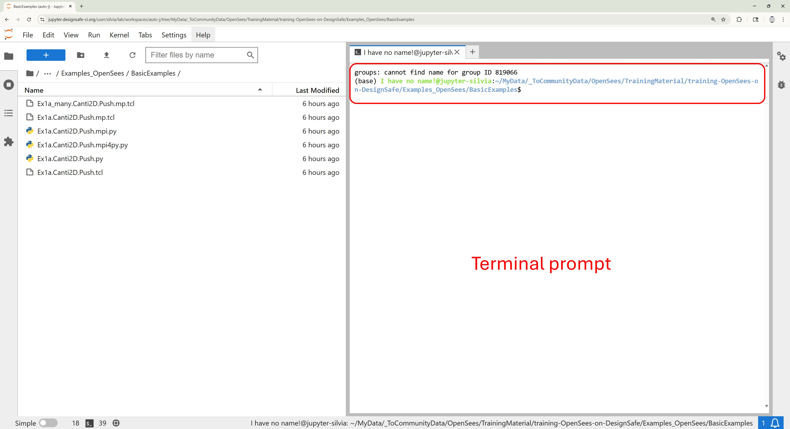
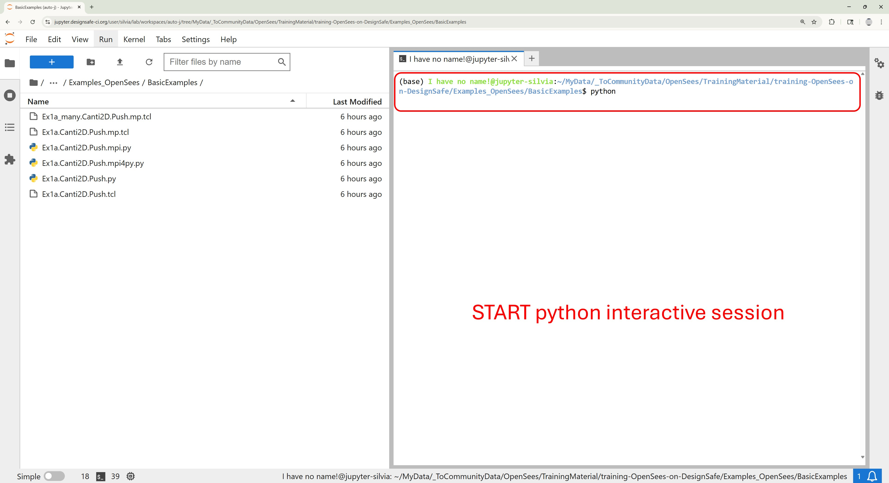
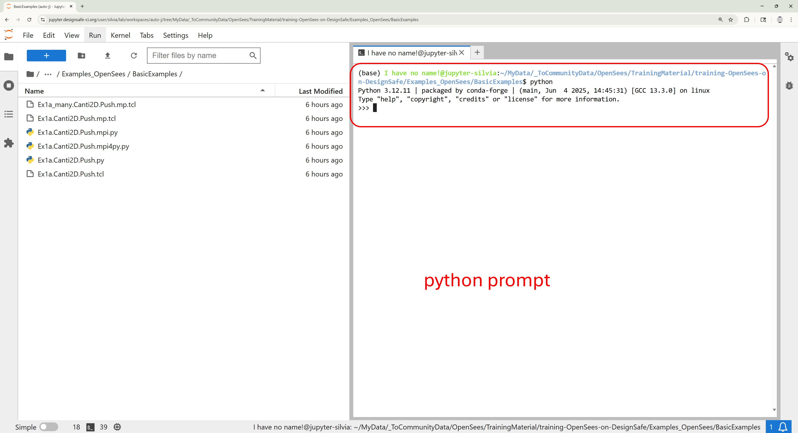
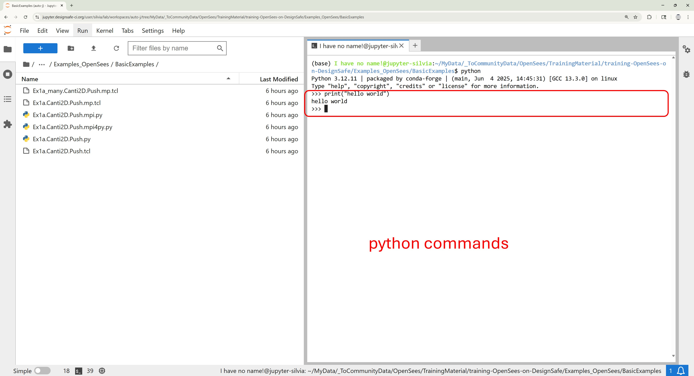
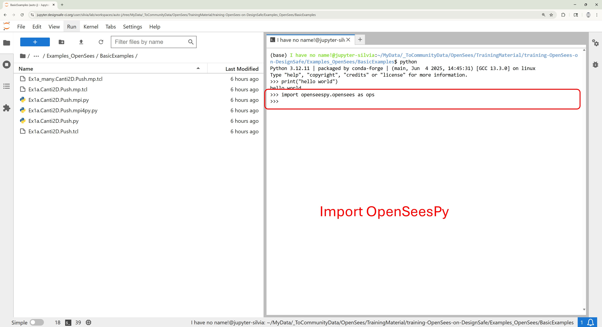
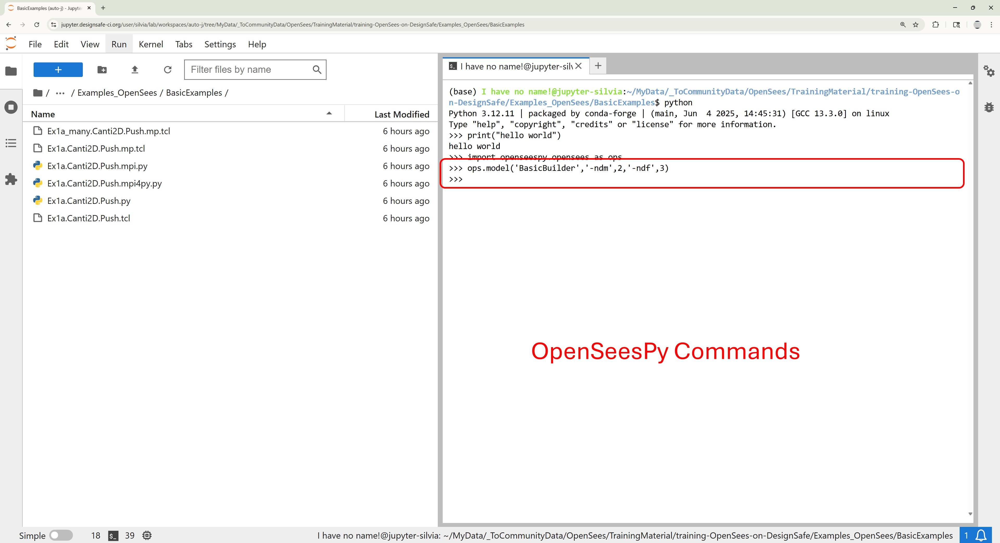
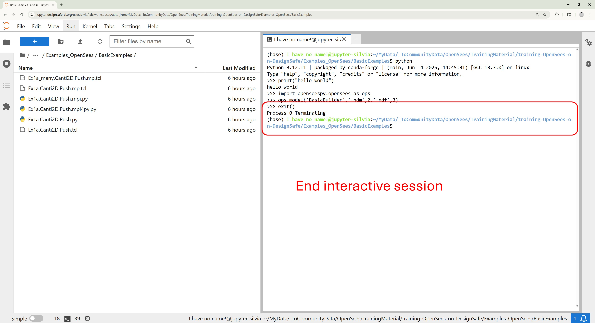

