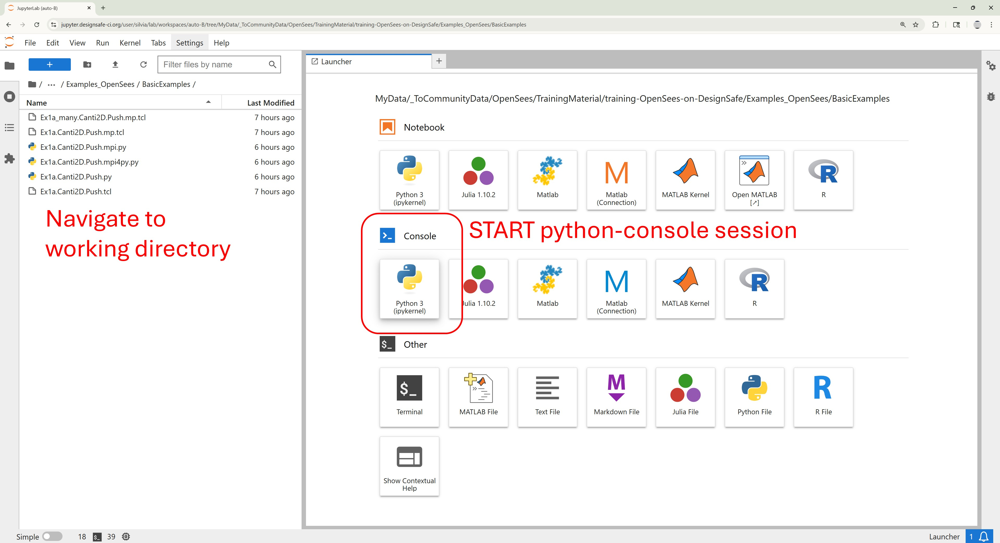
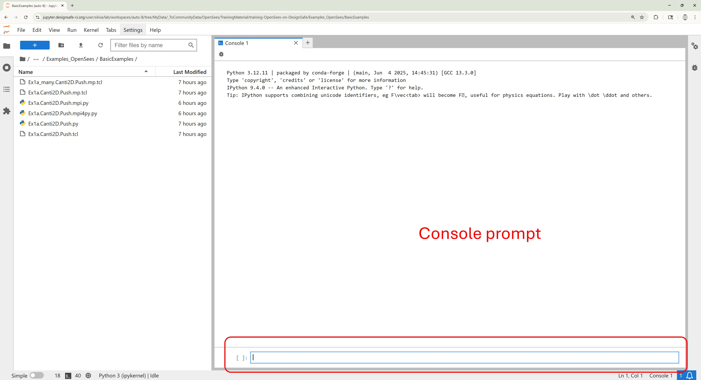
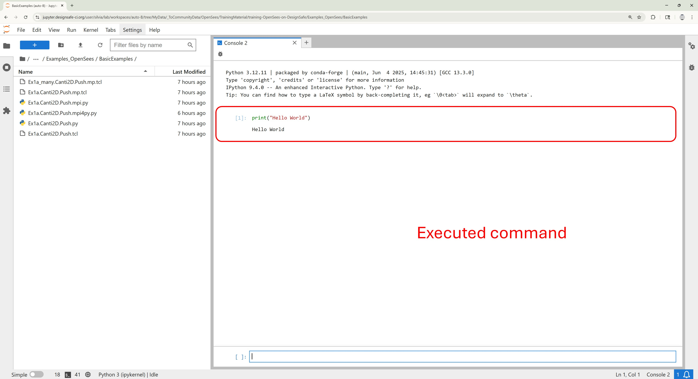
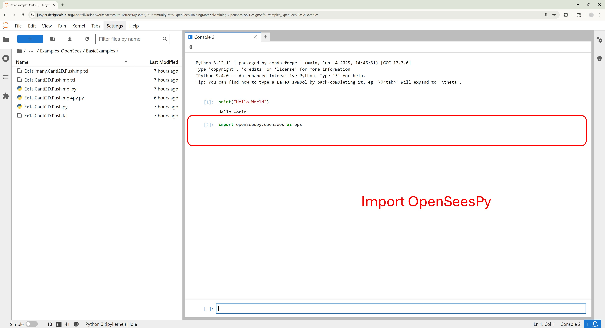
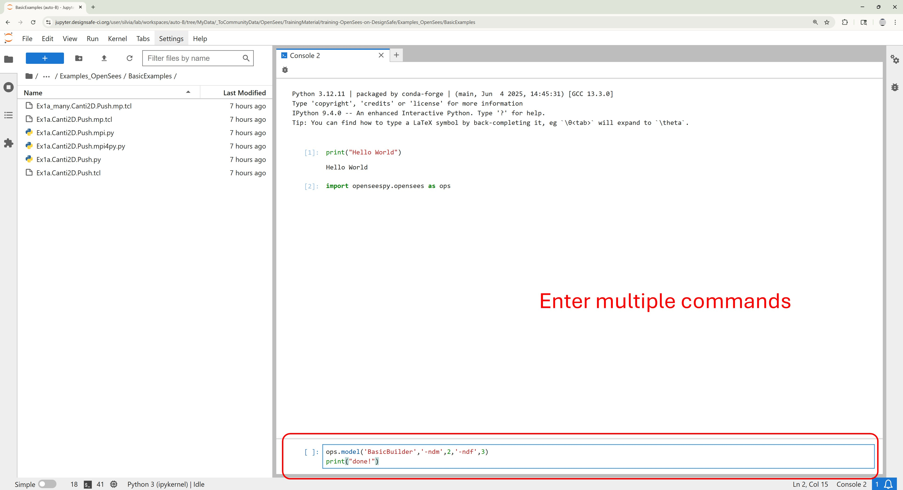
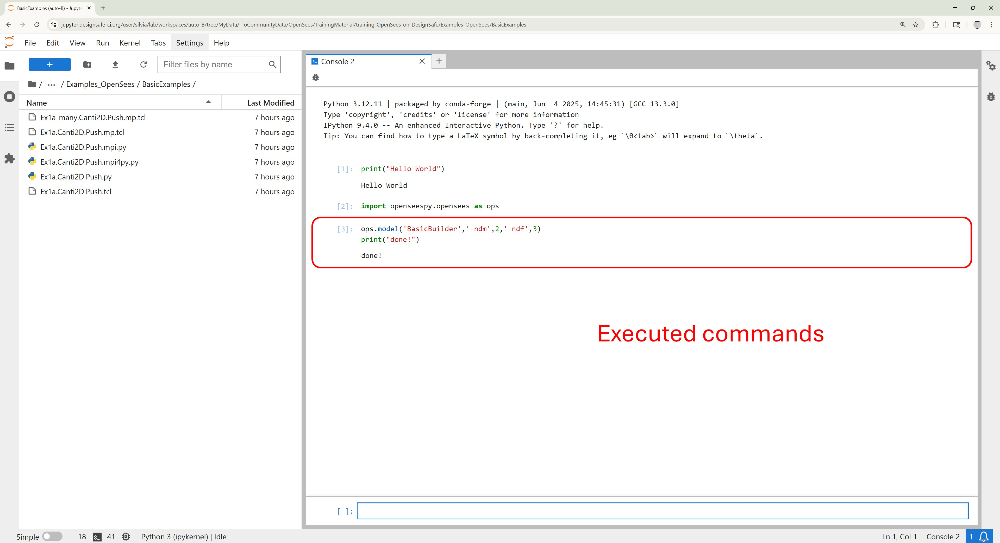
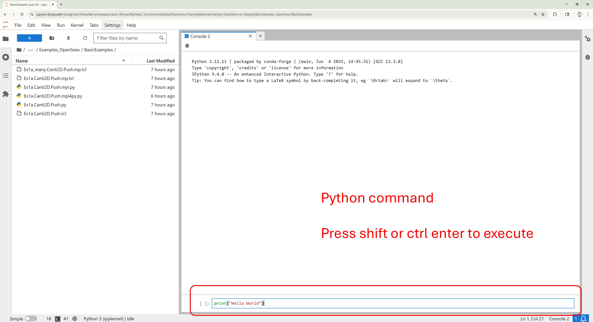
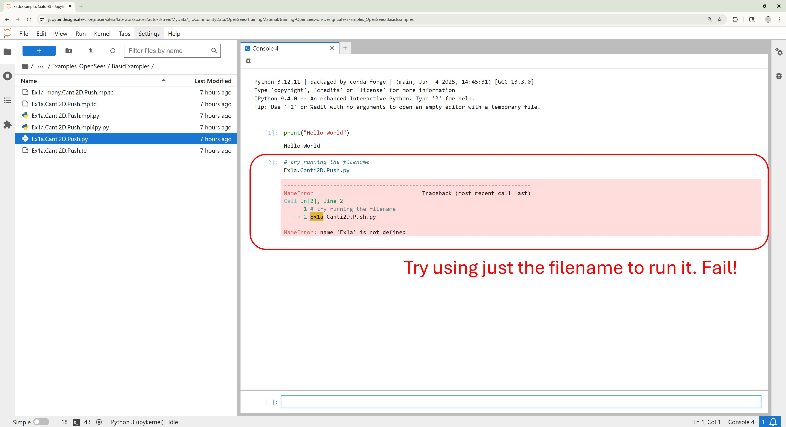
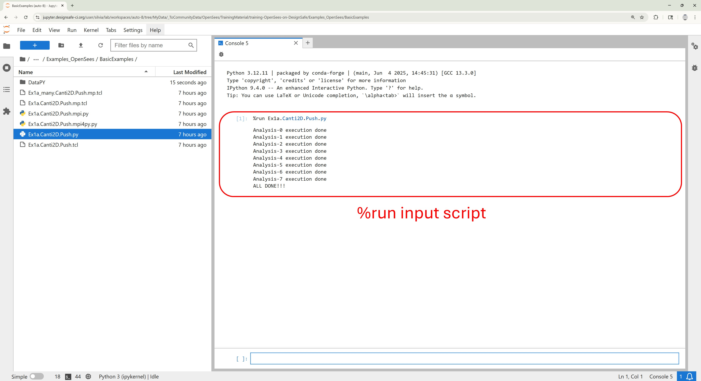
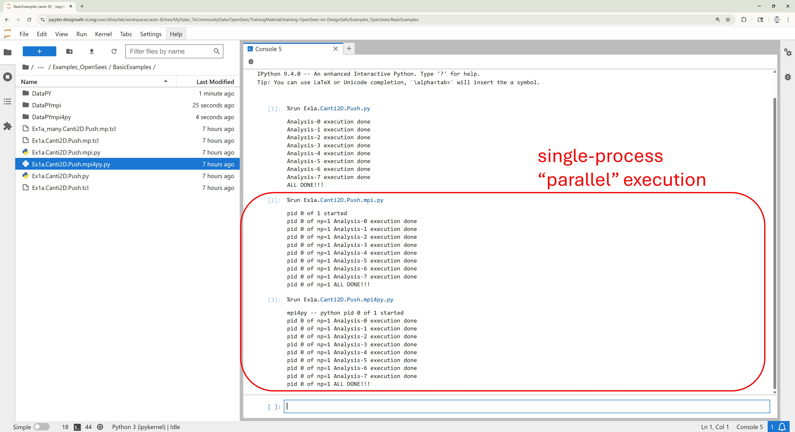

# Python Console

**Interactive Testing and Execution with OpenSeesPy**

The Python Console in JupyterHub allows you to run OpenSeesPy commands interactively—perfect for quick testing, debugging, or exploring new ideas.

If you already have a completed Python script, you can execute it directly in the console using the *%run* command:

```python
%run my_model.py
```

This is especially useful if you've developed your script in another environment (like Spyder or VS Code) and want to validate or rerun it within the JupyterHub environment without launching a full notebook.


## OpenSeesPy Interactive Console
**Example** Run Sequential OpenSees Analyses Interactively at the Python Console










## Run Script in Console
**Example** Run Sequential OpenSeesPy Analyses at the Python Console







